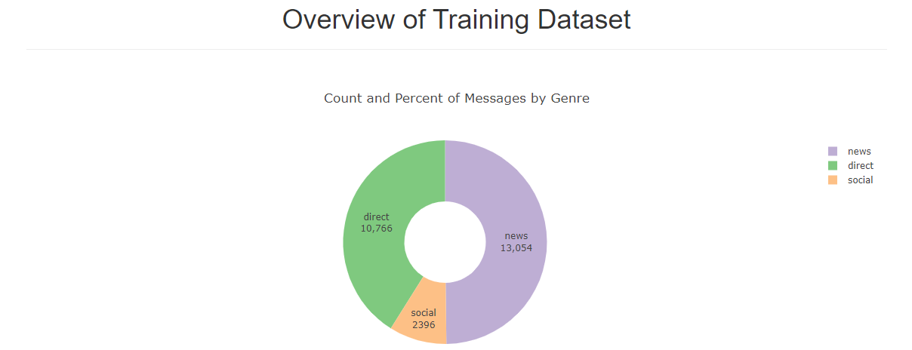
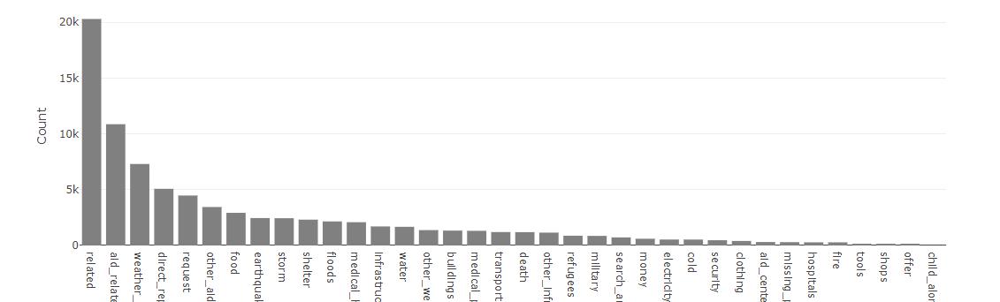

# Disaster Response Web App Project.

In this project, I'm analyzing disaster data from Figure Eight using my Data Scientist skills. The Extract, Transform, and Load (ETL) process, Natural Language Processing (NLP), and Machine Learning Pipeline are used to build the classifier model for disaster messages. The project also includes a web app that allows an emergency worker to enter a new message and receive classification results in a variety of categories. It can be useful in determining which messages require immediate attention in the event of a disaster.

<p align="left">
  

  

  <a href="https://rocketseat.com.br">
    
  </a>


## Table of Contents

- [Introduction](#iNtroduction)
- [Project Structure](#structure)
  - [ETL Pipeline](#etl_pipeline)
  - [ML Pipeline](#ml_pipeline)
  - [Flask Web App](#flask)
- [Running](#run)
  - [Data Cleaning](#cleaning)
  - [Training Classifier](#training)
  - [Starting the Web App](#starting)
- [Conclusion](#conclusion)
- [Files](#files)
- [Software Requirements](#sw)
- [Author](#author)
- [Credits and Acknowledgements](#credits)
- [License](#license)


<a id='introduction'></a>

## 1. Introduction
The dataset contains 30,000 messages drawn from events such as an earthquake in Haiti in 2010, an earthquake in Chile in 2010, floods in Pakistan in 2010, superstorm Sandy in the United States of America in 2012, and news articles spanning many years and hundreds of disasters.

The data has been encoded with 36 different categories related to disaster response and has been completely stripped of messages containing sensitive information.

The disaster response messages dataset is made up of data with imbalanced category labels. Some labels, such as aid-related and weather-related, have far more examples than others. Because the classes are not equally represented, this imbalance may have an impact on model training. It is possible to deal with it by resampling the dataset or by generating synthetic samples. Actually, i adressed the problem through considering different classes weights in the machine learning model used (Logistic Regression).


<a id='structure'></a>

## 2. Project Structure

There are three components of this project:

<a id='etl_pipeline'></a>

### 2.1. ETL Pipeline

File _data/process_data.py_ contains data cleaning pipeline that:

- Loads the `messages` and `categories` dataset
- Merges the two datasets
- Cleans the data
- Stores it in a **SQLite database**

<a id='ml_pipeline'></a>

### 2.2. ML Pipeline

File _models/train_classifier.py_ contains machine learning pipeline that:

- Loads data from the **SQLite database**
- Splits the data into training and testing sets
- Builds a text processing and machine learning pipeline
- Trains and tunes a model using GridSearchCV
- Outputs result on the test set
- Exports the final model as a pickle file

<a id='flask'></a>

### 2.3. Flask Web App

<a id='eg'></a>

Running [this command](#com) **from app directory** will start the web app where users can enter their query, i.e., a request message sent during a natural disaster, e.g. _"How can we get water and food in Rio de Janeiro? We have people in many differents needs, and also for medicine."_.

**Classification Example - Input Message**


What the app will do is that it will classify the text message into categories so that appropriate relief agency can be reached out for help.

**Classification Example - Results**


<a id='run'></a>

## 3. Running

There are three steps to get up and runnning with the web app if you want to start from ETL process.

<a id='cleaning'></a>

### 3.1. Data Cleaning

**Go to the project directory** and the run the following command:

```bat
python data/process_data.py data/disaster_messages.csv data/disaster_categories.csv data/DisasterResponse.db
```

The first two arguments are input data and the third argument is the SQLite Database in which we want to save the cleaned data. The ETL pipeline is in _process_data.py_.

_DisasterResponse.db_ already exists in _data_ folder but the above command will still run and replace the file with same information.

<a id='training'></a>

### 3.2. Training Classifier

After the data cleaning process, run this command **from the project directory**:

```bat
python models/train_classifier.py data/DisasterResponse.db models/classifier.pkl
```

This will use cleaned data to train the model, improve the model with grid search and saved the model to a pickle file (_classifer.pkl_).

_classifier.pkl_ already exists but the above command will still run and replace the file will same information.

It took me around **1 hour** to train the classifier with grid search.

<a id='starting'></a>

### 3.3. Starting the web app

Now that we have cleaned the data and trained our model. Now it's time to see the prediction in a user friendly way.

**Go the app directory** and run the following command:

<a id='com'></a>

```bat
python run.py
```

This will start the web app and will direct you to a URL where you can enter messages and get classification results for it.

**Running Example**


<a id='conclusion'></a>

## 4. Conclusions

Some information about training data set as seen on the main page of the web app.

**Analysis per genre**



**Analysis per category**



As we can see the data is highly imbalanced. Though the accuracy metric is [high] (you will see the exact value after the model is trained by grid search, it is ~0.86), it has a ok value for balanced accuracy (~0.77). So, take appropriate measures when using this model for decision-making process at a larger scale or in a production environment.


<a id='files'></a>

## 5. Files

<pre>
.
├── app
│   ├── run.py------------------------# FLASK FILE THAT RUNS APP
│   ├── static
│   │   └── favicon.ico---------------# FAVICON FOR THE WEB APP
│   └── templates
│       ├── go.html-------------------# CLASSIFICATION RESULT PAGE OF WEB APP
│       └── master.html---------------# MAIN PAGE OF WEB APP
├── data
│   ├── DisasterResponse.db-----------# DATABASE TO SAVE CLEANED DATA TO
│   ├── disaster_categories.csv-------# DATA TO PROCESS
│   ├── disaster_messages.csv---------# DATA TO PROCESS
│   └── process_data.py---------------# PERFORMS ETL PROCESS
├── visuals-------------------------------# PLOTS FOR USE IN README AND THE WEB APP
├── models
│   └── train_classifier.py-----------# PERFORMS CLASSIFICATION TASK
│   └── classifier.pkl-----------# SAVED ML MODEL
│   └── length_transformer.py-----------# PART OF THE ML PIPELINE

</pre>

<a id='sw'></a>

## 6. Software Requirements

This project uses **Python 3.9.7** and the necessary libraries are mentioned in _requirements.txt_.
The standard libraries which are not mentioned in _requirements.txt_ are _collections_, _json_, _operator_, _pickle_, _pprint_, _re_, _sys_, _time_ and _warnings_.


<a id='author'></a>

## 7. Author

Gustavo Aguiar 👋🏽 Get in Touch!

Production Engineer | Master's Student in Production Engineering and Computational System | Data Analyst and Physical Simulation Engineering

[](https://www.linkedin.com/in/gjmaguiar/?locale=en_US)
[](mailto:gustavoaguiar@id.uff.br)

<a id='credits'></a>

## 8. Credits and Acknowledgements

Thanks <a href="https://www.udacity.com" target="_blank">Udacity</a> for letting me use their logo as favicon for this web app.

I want to express my gratitude to Josh Bernhard, Robert Chang and the other Udacity reviewers for their genuine efforts and time. Their invaluable advice and feedback immensely helped me in completing this project.


<a id='license'></a>

## 9. License
This project is under the license [MIT](./LICENSE).
